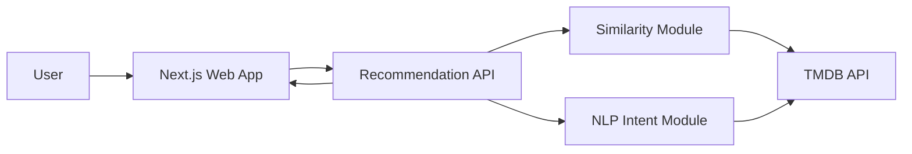

# Architecture Overview (Draft)

## System Boundary (Initial)
- **Client (Web Team)**: Next.js web app (search, input prompts, display recommendations).
- **Application API (Shared Boundary)**: endpoint layer and schema contract for recommendation requests.
- **Recommendation Engine (ML Team)**:
  - Similarity module (title-to-title matching).
  - NLP intent module (prompt-to-constraints parsing and retrieval).
- **External Data Source**: TMDB API.

## Draft Diagram (Mermaid)

## Notes
- Keep API contracts stable even if internals evolve.
- Start monolithic for speed; modularize internally by domain.
- Introduce caching after baseline functionality is correct.
- Simulate two-team workflow by planning and documenting Web and ML tracks independently.
